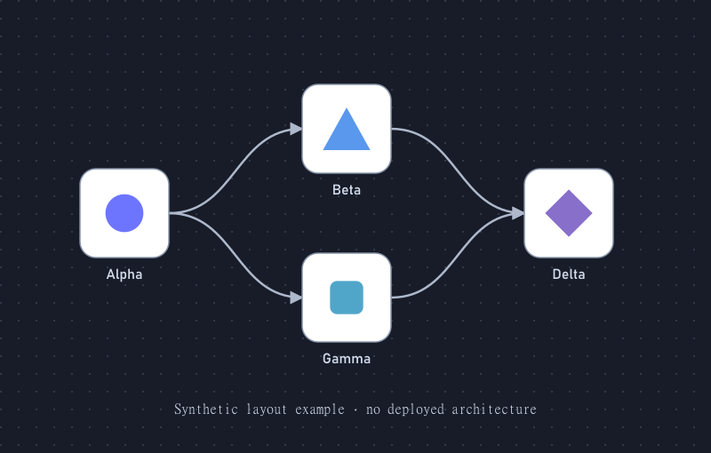

# Logo Flow Infographics

로고와 짧은 기술 이름으로 아키텍처·워크플로를 표현하는 Codex/Agent 스킬입니다. 어두운 점무늬 배경, 흰색 둥근 카드, 곡선 화살표를 사용하며 편집 가능한 SVG와 자산 출처 기록을 보존합니다.

## 예제



위 이미지는 가상의 이름과 직접 만든 도형을 사용한 스타일 예제입니다. 실제 시스템의 구축·연동을 의미하지 않습니다.

## 설치

스킬을 읽는 도구의 skills 디렉터리에 `logo-flow-infographics` 폴더로 복제합니다. 예를 들어 PowerShell에서는:

```powershell
git clone https://github.com/Kimhyuntae9665/codex-skill-logo-flow-infographics.git "$env:USERPROFILE/.agents/skills/logo-flow-infographics"
```

이미 같은 폴더가 있으면 덮어쓰지 말고 기존 설치를 확인하세요. 설치 후 새 대화에서 다음과 같이 요청할 수 있습니다.

```text
$logo-flow-infographics 제공한 로고로 이 흐름을 그려줘. SVG와 PNG도 저장해줘.
```

## 직접 실행

Python 3.9 이상을 사용합니다. SVG 생성에는 Python 표준 라이브러리만 필요하며, PNG 생성에는 PATH에 등록된 Inkscape가 필요합니다. 도구가 소프트웨어를 설치하거나 로고를 다운로드하지는 않습니다.

```powershell
python scripts/render_logo_flow.py assets/example-graph.json --svg ./output/flow.svg
python scripts/render_logo_flow.py assets/example-graph.json --svg ./output/flow.svg --png ./output/flow.png
```

SVG 옆에 `flow.manifest.json`이 생성됩니다. 로고 출처와 원본·정규화 파일 해시를 기록하며, 최종 픽셀 확인은 별도로 필요합니다.

## 구성과 범위

- [SKILL.md](SKILL.md): 스타일, 사실 경계, 검증·전달 지침
- [scripts/render_logo_flow.py](scripts/render_logo_flow.py): 로컬 SVG 자산을 포함하는 렌더링 도구
- [assets/example-graph.json](assets/example-graph.json): 수정 가능한 예제 흐름
- [references/input-contract.md](references/input-contract.md): 그래프·자산 입력 형식
- [references/export-checks.md](references/export-checks.md): 내보내기와 시각 검증 기준

기본 도구는 왼쪽에서 오른쪽으로 진행하는 정적 그래프를 지원합니다. 노드 1–60개, 간선 최대 120개이며, 순환·역방향 연결에는 다른 렌더러를 선택해야 합니다. 실제 로고는 사용자가 제공하거나 승인한 자산을 사용하고 출처·해시·라이선스 또는 상표 관련 사항을 기록합니다. 예제 도형에는 제삼자 브랜드 로고가 포함되어 있지 않습니다.
