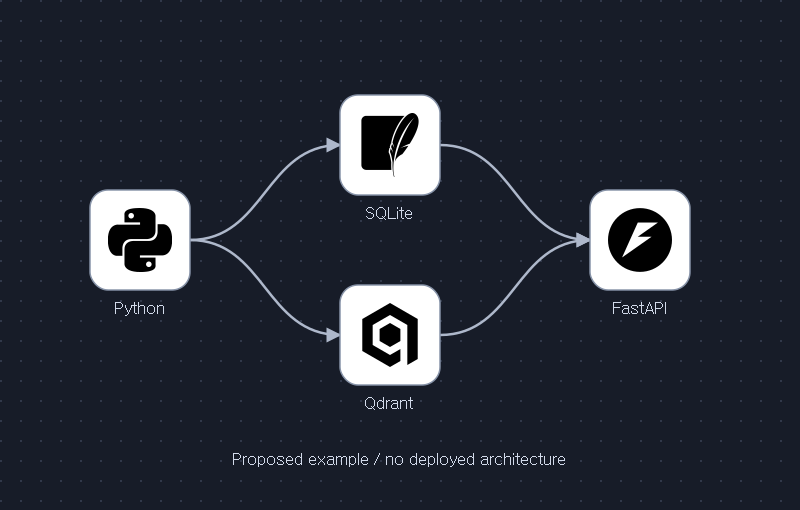
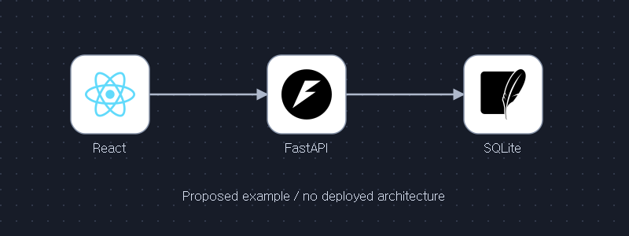
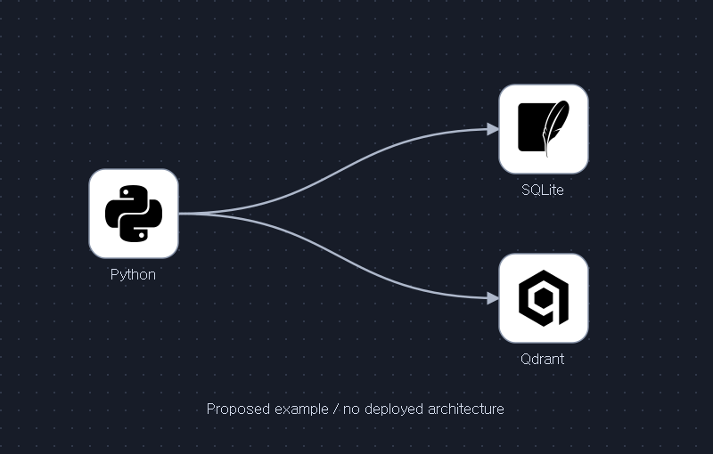
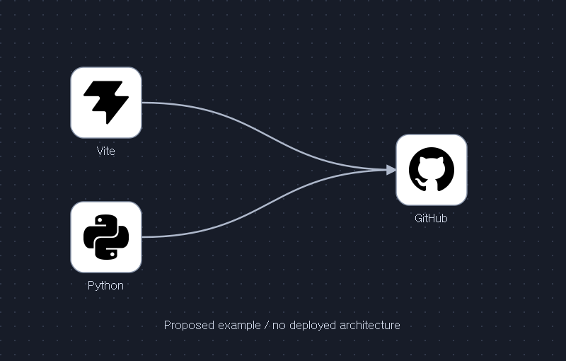
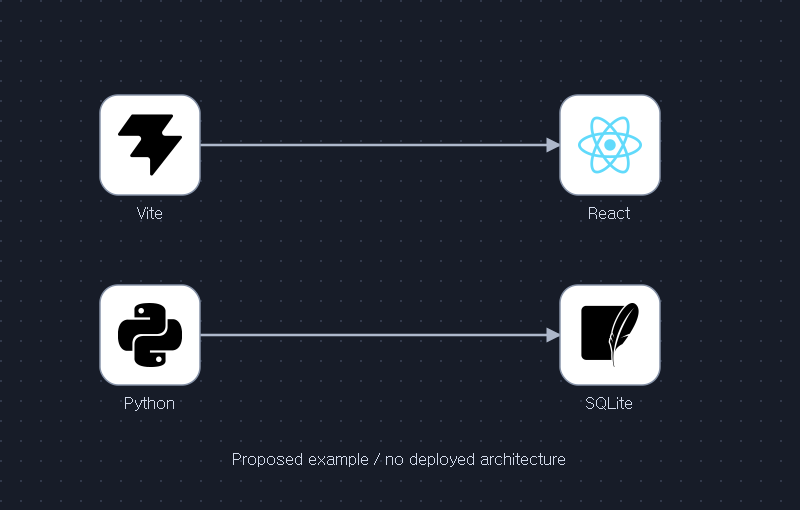
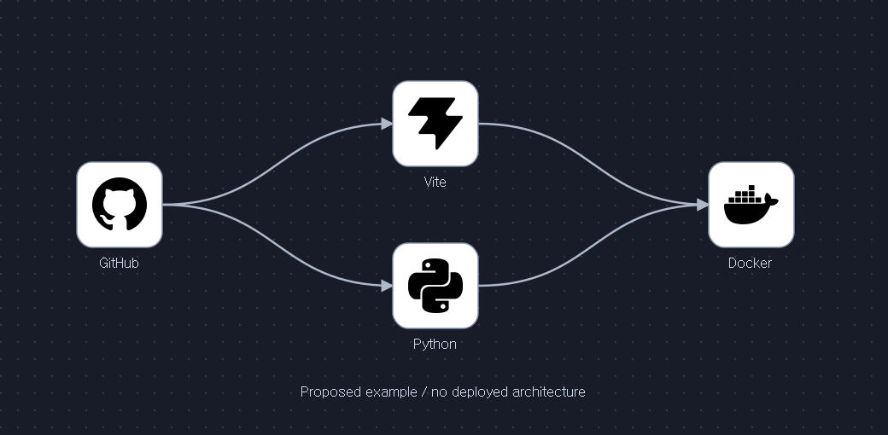

# Logo Flow Infographics

**실제 로고로 기술 흐름을 짧고 명확하게 그리는 Codex 스킬.**

어두운 점무늬 배경 위에 흰색 카드와 곡선 화살표를 배치합니다. **카드 안에는 로고 심볼만, 카드 바로 아래에는 기술명**을 넣습니다. 에이전트 흐름에서는 그 아래에 **각 에이전트의 짧은 역할**도 표시합니다. PNG로 공유하고, SVG와 JSON으로 수정할 수 있습니다.

*A Codex skill for logo-first architecture and workflow diagrams: real symbols inside cards, short technology names below, editable SVG, and pinned asset provenance.*



갤러리는 **설명용 제안 그래프**입니다. 실제 서비스의 구축·연동·배포를 증명하지 않습니다. 화살표의 뜻은 각 예시 설명에 따로 적었습니다.

## 바로 사용하기

설치 후 Codex에서 다음처럼 요청합니다. 로고를 직접 제공해도 됩니다.

```text
$logo-flow-infographics
React → FastAPI → Python 흐름을 그려줘.
실제 로고 심볼을 찾아 사용하고 출처를 기록해줘.
카드 안에는 로고만, 카드 아래에는 기술명을 넣어줘.
제안용 구조라고 표시하고 SVG, PNG, 자산 manifest를 저장해줘.
```

**이 스킬은 그림을 만듭니다.** API 서버를 실행하거나 화살표에 해당하는 시스템을 구현하지는 않습니다. 실제 프로젝트를 그릴 때에는 코드나 사용자가 제공한 흐름에서 확인한 연결만 표현합니다.

## 에이전트 역할을 그림에서 바로 읽기

같은 Astra·Sol 로고가 여러 번 나오면 모델명만으로 담당을 구별하기 어렵습니다. 에이전트 다이어그램에는 `모델명 → 짧은 역할`의 두 줄을 카드 아래에 표시합니다. 예: **GPT-6 Astra / Skeptic · 반례 검토**, **GPT-6 Astra / Creative · 독창적 제안**. 실제로 정의된 역할만 사용하며, 임의로 긍정론자·비관론자라고 붙이지 않습니다. 로고 카드 안에는 계속 심볼만 둡니다.

JSON의 노드에 `role`을 넣으면 렌더러가 두 번째 줄을 추가합니다. 같은 브랜드 이름이나 로고를 역할 이름으로 바꾸지 않습니다.

```json
{"id": "creative", "asset": "astra", "x": 340, "y": 190, "role": "Creative / 독창적 제안"}
```

에이전트마다 표시하고, 줄 간격·다음 카드·캔버스 경계를 SVG와 PNG에서 확인합니다. 일반 기술 흐름의 `role`은 선택 사항이며 같은 기술이 다른 역할로 반복되면 구분 라벨을 붙입니다. `role`은 32자 이내 한 줄입니다. [역할이 표시된 Council 예시](https://github.com/Kimhyuntae9665/codex-skill-council#흐름을-한눈에-보기)를 참고하세요.

*Agent diagrams add a short node-level `role` below each technology/model name. Names identify the technology; roles identify the job. Both remain outside the logo card and visible in SVG/PNG. Existing graphs without role labels still render as before.*

## 설치 방법

필요한 것: Git, Codex 또는 `SKILL.md`를 읽는 에이전트. Python은 로컬 렌더링 도구를 직접 실행할 때 필요합니다.

**Windows · PowerShell**

```powershell
git clone https://github.com/Kimhyuntae9665/codex-skill-logo-flow-infographics.git "$env:USERPROFILE/.agents/skills/logo-flow-infographics"
```

**macOS · Linux**

```bash
git clone https://github.com/Kimhyuntae9665/codex-skill-logo-flow-infographics.git "$HOME/.agents/skills/logo-flow-infographics"
```

Codex를 다시 시작하고 `$logo-flow-infographics`로 호출합니다. 다른 에이전트에서는 해당 도구의 스킬 디렉터리를 사용하세요. 같은 폴더가 있다면 덮어쓰지 말고 기존 설치와 변경 사항부터 확인하세요.

## 예시 갤러리

모든 새 예시는 **실제 프로젝트의 심볼 + 가상의 제안 흐름** 조합입니다. 로고의 정체성과 시스템의 실제 구현 여부는 별도로 판단합니다. 각 예시에는 수정 가능한 `graph.json`, `output.svg`, `output.png`, `output.manifest.json`이 있습니다.

### 1. 직렬 흐름 · 한 단계씩 읽기



React가 FastAPI에 요청하고 FastAPI가 SQLite를 읽고 쓰는 제안입니다. 화살표는 요청·데이터 전달 방향이며 실제 연동 구현을 포함하지 않습니다.

[입력 JSON](examples/01-linear/graph.json) · [SVG](examples/01-linear/output.svg) · [출처·해시](examples/01-linear/output.manifest.json)

### 2. 분기 · 한 입력에서 두 경로로



Python 작업이 구조화된 기록을 SQLite에, 벡터 데이터를 Qdrant에 전달한다는 제안입니다. 분기는 서로 다른 저장 목적지를 뜻하며 실행 순서·원자성까지 정하지 않습니다.

[입력 JSON](examples/02-fan-out/graph.json) · [SVG](examples/02-fan-out/output.svg) · [출처·해시](examples/02-fan-out/output.manifest.json)

### 3. 병합 · 서로 다른 입력을 한곳으로



Vite 빌드 산출물과 Python 검사 보고서를 GitHub에 모은다는 제안입니다. 화살표는 파일·보고서 전달 방향이며 업로드 구현이나 동기화 조건까지 정의하지 않습니다.

[입력 JSON](examples/03-fan-in/graph.json) · [SVG](examples/03-fan-in/output.svg) · [출처·해시](examples/03-fan-in/output.manifest.json)

### 4. 분기 후 병합 · 다이아몬드


Python이 SQLite와 Qdrant에 데이터를 준비하고, FastAPI가 두 저장소의 조회 결과를 받는다는 제안입니다. 화살표는 데이터 전달이며 실제 RAG 서비스나 제품의 기본 연동을 주장하지 않습니다.

[입력 JSON](examples/04-diamond/graph.json) · [SVG](examples/04-diamond/output.svg) · [출처·해시](examples/04-diamond/output.manifest.json)

### 5. 병렬 경로 · 연결을 추가하지 않고 나란히



위쪽의 Vite → React는 프런트엔드 산출물 흐름, 아래쪽의 Python → SQLite는 데이터 저장 흐름입니다. 두 줄 사이에는 간선이 없으므로 서로 연동된다고 읽으면 안 됩니다.

[입력 JSON](examples/05-parallel/graph.json) · [SVG](examples/05-parallel/output.svg) · [출처·해시](examples/05-parallel/output.manifest.json)

### 6. 빌드·검사 제안 · 기술 흐름에 역할 설명 붙이기



GitHub 소스로 Vite 빌드와 Python 검사를 수행한 뒤 산출물과 검사 통과 결과를 Docker 이미지 준비에 사용한다는 제안입니다. 화살표는 릴리스 입력 관계입니다. 실제 CI 실행기·배포 대상·자동 실행은 포함하지 않았습니다.

[입력 JSON](examples/06-ci-cd/graph.json) · [SVG](examples/06-ci-cd/output.svg) · [출처·해시](examples/06-ci-cd/output.manifest.json)

**더 많은 요청문:** [12가지 상황별 프롬프트와 수정 방법](docs/EXAMPLES.md). **로고 원본:** [자산 출처·라이선스·상표 기록](examples/assets/SOURCES.md).

## 에이전트 없이 직접 실행하기

저장소를 복제한 디렉터리에서 실행합니다. **Python 3.9 이상**, SVG 생성에는 표준 라이브러리만 필요합니다. 렌더러는 네트워크 요청이나 소프트웨어 설치를 하지 않습니다.

```bash
# 예시 하나 → SVG + manifest
python scripts/render_logo_flow.py examples/01-linear/graph.json --svg output/my-flow.svg

# 예시 여섯 개를 모두 다시 생성 → SVG + manifest
python scripts/render_examples.py --output output/gallery

# 이미 Inkscape가 설치되어 PATH에 있을 때 → PNG도 생성
python scripts/render_examples.py --output output/gallery --png-renderer inkscape

# 이미 CairoSVG와 네이티브 Cairo가 동작하는 환경의 대안
python scripts/render_examples.py --output output/gallery --png-renderer cairosvg
```

`render_logo_flow.py --png output/my-flow.png`는 **Inkscape**를 사용합니다. 갤러리 도구의 `--png-renderer`는 명시적으로 선택하는 별도 옵션입니다. PNG 환경이 없으면 SVG를 그대로 사용하거나 미리 만든 PNG를 확인하세요. 실행 성공 후에도 로고·글자·화살표를 실제 이미지에서 확인해야 합니다.

### 내 흐름으로 바꾸기

1. 예시의 `graph.json`을 복사합니다. 그래프 위치를 옮기면 `asset_manifest`의 상대 경로도 맞춥니다.
2. `nodes`에 기술과 좌표를, `edges`에 연결 방향을 적습니다.
3. `description`에 화살표의 의미를, `basis`에 사용자 흐름이나 확인한 코드 출처를 적습니다.
4. 제안이면 `status: "proposed"`와 `disclaimer`를 유지합니다. 실제 구현 근거가 있을 때만 `implemented`를 사용합니다.
5. SVG를 생성한 뒤 이미지를 열어 확인합니다.

```json
{
  "title": "Proposed request flow",
  "status": "proposed",
  "basis": "Documentation example; no inspected deployment",
  "description": "React sends a request to FastAPI. Arrow means proposed request direction.",
  "asset_manifest": "../assets/manifest.json",
  "width": 600,
  "height": 300,
  "nodes": [
    {"id": "ui", "asset": "react", "x": 100, "y": 70},
    {"id": "api", "asset": "fastapi", "x": 380, "y": 70}
  ],
  "edges": [{"source": "ui", "target": "api"}],
  "disclaimer": "Proposed example / no deployed architecture"
}
```

위 경로는 `examples/<내-예시>/graph.json`에 저장할 때의 기준입니다. [입력 형식 전체](references/input-contract.md)와 [로고 추가 안내](docs/EXAMPLES.md)를 확인하세요.

## 지켜야 할 표현 규칙

| 요소 | 기준 |
| --- | --- |
| 흰색 카드 안 | 식별 가능한 실제 심볼만. 워드마크·기술명·단계 설명 제외 |
| 카드 아래 | 짧고 정확한 기술명. 카드 안 글자를 빼도 이 이름은 유지 |
| 화살표 | 제공한 흐름이나 확인한 코드에 있는 연결. 로고만으로 연동을 추정하지 않음 |
| 실제 로고 | 공식 심볼 원본 우선. 출처·고정 리비전·해시·이용 조건 기록 |
| 로고가 없을 때 | 제한을 밝히고 이름 카드 사용. 유명 브랜드를 가짜 심볼로 대체하지 않음 |
| 기존 그림 수정 | 라벨만 바꾸는 요청에서는 노드·연결·배치를 유지 |

원본 스타일 테스트는 [가상의 Alpha/Beta/Gamma/Delta 예시](preview/example.png)입니다. 그 도형은 실제 브랜드를 대신하는 로고가 아닙니다.

## 범위와 문제 해결

로컬 도구는 **왼쪽에서 오른쪽으로 진행하는 정적 그래프**를 지원합니다. 노드 1–60개, 간선 최대 120개, 카드 100px, 심볼 최대 64px, 외부 이름 16px입니다. JSON을 읽고 SVG를 생성하며 연결된 시스템을 실행하지 않습니다.

| 상황 | 해결 |
| --- | --- |
| `PNG needs already installed Inkscape` | SVG만 만들거나 이미 동작하는 CairoSVG를 갤러리 옵션으로 선택 |
| `Asset size or hash mismatch` | 원본을 확인한 후 정확한 SHA-256을 manifest에 기록 |
| `Asset must stay within manifest directory` | 로고 파일을 manifest와 같은 디렉터리 또는 그 아래에 배치 |
| `Helper requires forward left-to-right edges` | 다음 노드의 x를 이전 카드 오른쪽 끝보다 크게 배치. 순환 구조는 다른 렌더러 사용 |
| `Unsupported SVG element` | 안전한 심볼 SVG를 찾거나 승인한 자산을 지원하는 다른 도구 사용 |
| 긴 이름·한글이 잘리거나 깨짐 | 좌표·여백·폰트를 확인하고 최종 PNG를 육안 검수 |
| Wordmark밖에 없는 브랜드 | 그림을 덧칠해 글자를 지우지 말고 공식 심볼을 더 찾거나 이름 카드로 표현 |

PNG/GIF 로고, 순환·역방향 간선, 복잡한 교차 연결은 기본 Python 도구의 범위 밖입니다. 다른 렌더러를 쓰더라도 출처·정확한 이름·연결 의미·시각 검수 규칙을 유지합니다.

## 저장소 구성

```text
SKILL.md                       에이전트가 읽는 핵심 지침
agents/openai.yaml             스킬 표시 정보
scripts/render_logo_flow.py    그래프 하나 렌더링
scripts/render_examples.py     갤러리 전체 재생성
examples/01-linear/ ...        6개 입력·SVG·PNG·manifest
examples/assets/               실제 로고 원본과 출처
docs/EXAMPLES.md              12가지 요청 예시와 수정 안내
references/                    입력 형식·내보내기 검수
tests/                        렌더링 동작과 잘못된 입력 검증
```

로고에는 각 프로젝트의 저작권·라이선스·상표 조건이 적용됩니다. 출처와 해시는 이용 허가나 브랜드의 보증을 의미하지 않습니다. 제삼자 자산의 개별 조건과 보존한 라이선스 문구는 [출처 기록](examples/assets/SOURCES.md)을 확인하세요.

기여하려면 입력 JSON과 실제 렌더링 결과를 함께 확인하세요. 새 브랜드는 심볼 원본과 출처를 기록하고 가상의 연결은 제안임을 명시해 주세요.

```bash
python -m unittest discover -s tests -v
python scripts/render_examples.py --output output/check
```
